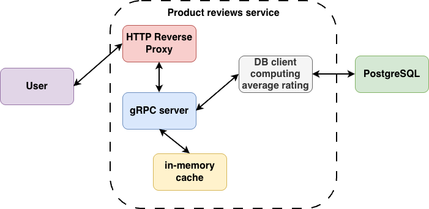
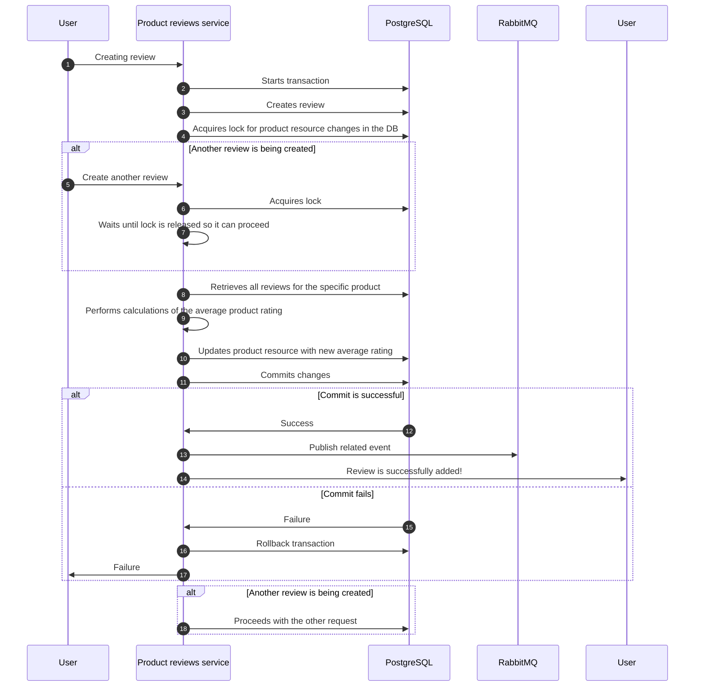

## Task definition
Main task was to create a product reviews subsystem that allows users to create/edit/delete products and add/modify/delete reviews to these products.
Also, average product rating based on the set of reviews must be calculated in concurrency-safe way.
Any event manipulating review must notify other services.


## Prerequisites
Before running anything, please run `make deps` to install all necessary dependencies for this project.


## Assumptions
Task does not specify, but I assume that user can add multiple reviews to the same product thus impacting its review. 
Restricting user for solely 1 review per product is out of scope of this task.

Another requirement is that the cache must be implemented to hold average product ratings and list of the reviews. This is vaguely defined, thus 
next assumption is made: `average product rating` will be a part of the `Product` resource definition what leads to caching of products. 
According to the task definition there is no direct endpoint through which user can request `average product rating`. 
The disadvantage of that is that only `Get` requests would benefit from caching. Other operations `Create`/`Modify`/`Delete` 
would directly invalidate cache because the change is affecting its state. Designing caching strategy propoerly is out of scope of this task.

Before implementing anything I;ve decided to make `average rating` a part of the `Product` resource definition even though task allowed not to do so.
Concurrency-safeness of average rating calculations would then be achieved by locking the DB for the time of the computations.
This is a bottleneck for scaling. Somehow, task does not define scaling as its primary goal. In any way, scaling issue must be acknowledged.

To avoid low-level DB queries, an ORM library was used.

To satisfy notification part of the task, any event related to manipulation of review is published to `RabbitMQ`.


## Architecture
When designing the architecture I was relying on my previous knowledge of building similar systems.

As a backend DB to track `Product` and `Review` resources in the system, `PostgreSQL` is chosen. Classical, relibable, and relational. 
Task definition of resources requires maintaining relations between resources, thus making `PostgreSQL` an obvious choice for this task.
This approach also allows to use such ORM libraries as `ENT` (production-grade solution), which can also autogenerate Golang boilerplate code for various SQL queries.

The easiest way to define API (honestly, depends on the SW Engineer) is to use Protobuf. Protobuf allows great flexibility by generating boilerplate code for
gRPC server. Task definition required RESTful API. To address that, an HTTP reverse proxy gateway is additionally generated to the gRPC server. 
At the very end of this document you can see `curl` commands to interfact with it.

Another benefit of defining API in Protobuf is its ability to be reused for autogenerating `ENT` schema with `protoc-gen-ent`.
This way, we have a single point of managing both, API and DB resource definitions, in case any change is needed to be done in schema (obviously, affecting API).

For the cache itself, and in-memory cache is chosen. My goal was to make it as simple as possible. 
Somehow, for large-scale production systems a more suitable solution like `redis` should be used.

Following diagram depicts the whole architecture of the `Product reviews system`.




## Concurrency-safe average rating calculations
As was mentioned above, concurrency-safeness in computing average product rating is achieved by locking DB for the time of computations. 
This is achieved with transactions (e.g., `updateProductAverageRating()` function in [this](pkg/client/db/client.go) file).
Following block diagram show the flow.



## Caching
Caching layer is implemented using `github.com/maypok86/otter`. 
It currently stores following data:
- product by ID.
- review list by product.

This is the simplest implementation of cache to satisfy the task.
Logic is following:
- whenever `Get` request happens, look into cache first.
  - if found in cache, return from cache.
  - if not found in cache, go to DB.
- whenever `Create` action happens:
  - in case of `Product`, simply add entry to cache.
  - in case of `Review`, invalidate whole review list cached for the specific product. It will be fetched again during `Get` operation.
- whenever `Edit` action happens, invalidate entry => it will be cached again on `Get` operation.
- whenever `Delete` action happens, simply remove the entry.


## Usage
You can bring up whole solution simply by running `make up`, which will buidl Docker image and start Docker compose environment.


## Example commands
**CreateProduct**
```bash
curl -X POST "http://localhost:50052/v1/product/create" \
     -H "Content-Type: application/json" \
     -d '{ "product": { "name": "Example Product", "description": "This is an example product.", "price": "19.99" } }'
```

**GetProductByID**
```bash
curl -X GET "http://localhost:50052/v1/product/get/{product_id}"
```

**EditProduct**
```bash
curl -X PATCH "http://localhost:50052/v1/product/edit" \
     -H "Content-Type: application/json" \
     -d '{ "product": { "id": "{product_id}", "name": "Updated Product Name", "description": "Updated description.", "price": "29.99" } }'
```

**DeleteProduct**
```bash
curl -X DELETE "http://localhost:50052/v1/product/{product_id}"
```

**ListProducts**
```bash
curl -X GET "http://localhost:50052/v1/product/all"
```

**CreateReview**
```bash
curl -X POST "http://localhost:50052/v1/review/create" \
     -H "Content-Type: application/json" \
     -d '{ "review": { "product": { "id": "{product_id}" }, "first_name": "John", "last_name": "Doe", "review_text": "Great product!", "rating": 5 } }'
```

**GetReviewsByProductID**
```bash
curl -X GET "http://localhost:50052/v1/review/get/product/{product_id}"
```

**EditReview**
```bash
curl -X PATCH "http://localhost:50052/v1/review/edit" \
     -H "Content-Type: application/json" \
     -d '{ "review": { "id": "{review_id}", "first_name": "Jane", "last_name": "Doe", "review_text": "Good product, but a bit pricey.", "rating": 4 } }'
```

**DeleteReview**
```bash
curl -X DELETE "http://localhost:50052/v1/review/{review_id}"
```
